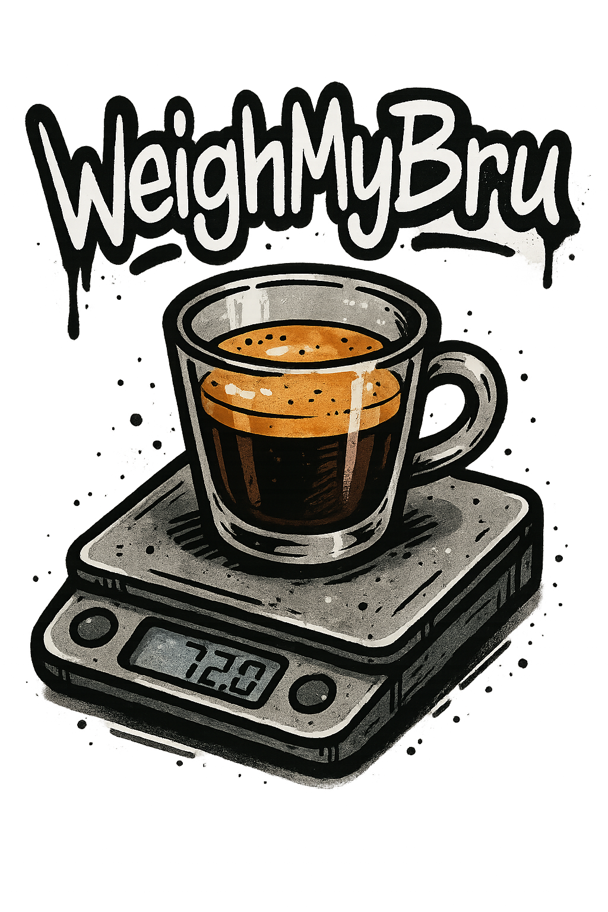
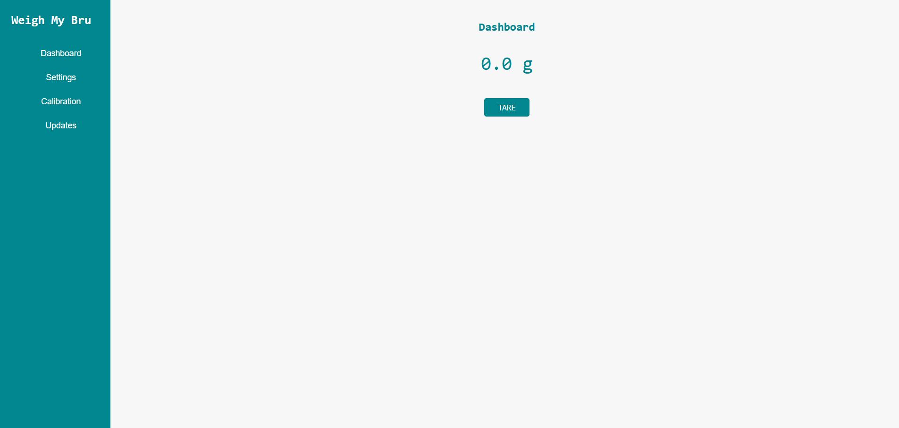

<p align="center">

</p>

<p align="center">  <b>The smart espresso scale you've been looking for!</b></p>
<br>

[](https://discord.gg/HYp4TSEjSf)
[](LICENSE)

This project is a headless scale at the moment with a webserver hosted on the ESP32-S3.
This scale was designed to be used in conjunction with GaggiMate.
<br>
<br>


## Documentation

The documentation is currently being worked on. 

[WeighMyBru Docs](https://github.com/031devstudios/weighmybru-docs)

## Features

- Webserver via WiFi
- Bluetooth connectivity to GaggiMate
- Calibration via webserver
- Real-time flowrate display
- Adjustable decimal point readings

## GaggiMate

GaggiMate now fully supports WeighMyBru scale.

[GaggiMate)](https://github.com/jniebuhr/gaggimate)

## Installation

Installation instructions will be updated soon.

```
  this project requires VSCode with PlatformIO extension installed
```

## Bill Of Materials (BOM)

| Qty | Item | 
| ----------- | ----------- |  
| 2 | 500g Mini Loadcell (I-shaped) |  
| 1 | HX711 |
| 1 | ESP32-S3-WROOM Dev Board |
| 1 | USB-C Breakout Panel Mount |
| 1 | Various Wires |