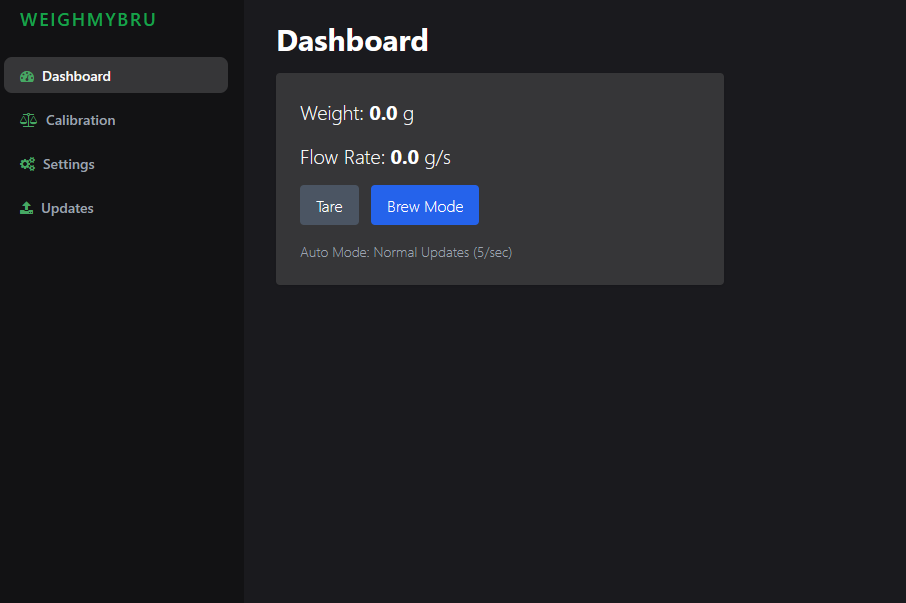

<p align="center">

</p>

<p align="center">  <b>The smart espresso scale you've been looking for!</b></p>
<br>

[](https://discord.gg/HYp4TSEjSf)
[](LICENSE)

This project is a headless scale at the moment with a webserver hosted on the ESP32-S3.
This scale was designed to be used in conjunction with GaggiMate.
<br>
<br>



## Features

- Webserver via WiFi
- Bluetooth connectivity to GaggiMate
- Calibration via webserver
- Real-time flowrate display
- Adjustable decimal point readings

## GaggiMate

At the moment, the current GaggiMate does not support WeighMyBru scale. I am still waiting on the PR to be merged with the origianl repo. Below is the link to the fork that supports WeighMyBru scale. It's up to date with the following commit `6a2241c`
I will make sure I keep it updated constantly.

[GaggiMate (WeighMyBru version)](https://github.com/031devstudios/gaggimate)

## Installation

Installation instructions will be updated soon.

```
  this project requires VSCode with PlatformIO extension installed
```

